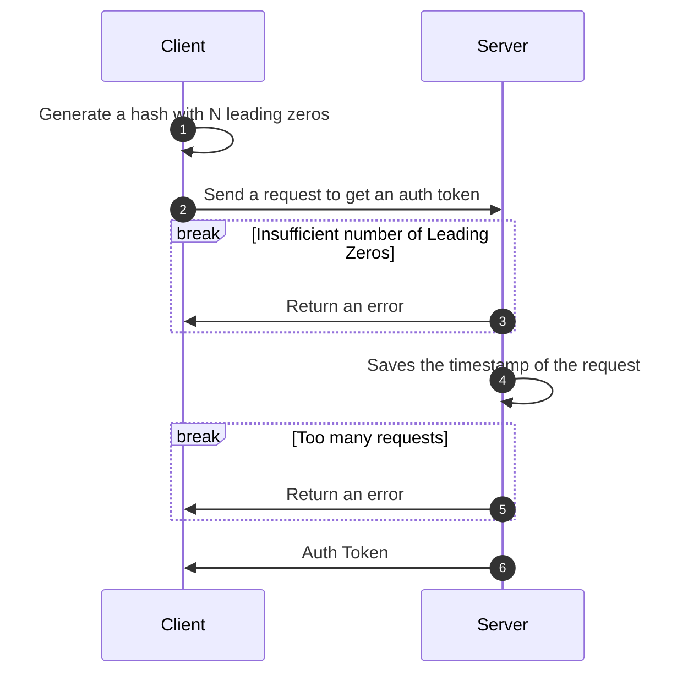

# POW Account

This library introduces a password-less authentication mechanism for open-source applications, utilizing a proof-of-work approach to enhance security and mitigate DDoS attacks. By requiring clients to generate cryptographic hashes with a specified number of leading zeros, this method not only eliminates the need for traditional authentication (e.g., usernames and passwords) but also provides a robust defense against malicious requests.

## Key features
- **Password-less authentication**. Users do not need to create and use a password;
- **No identity disclosing**.  Users authenticate without the need for credentials such as emails, or phone numbers;
- **Protection from DDoS attack**. The library implements a proof-of-work (PoW) model where clients must perform computationally intensive tasks (generating hashes) before sending a request. This makes it expensive for attackers to flood the server with requests, effectively mitigating Distributed Denial of Service (DDoS) attacks;

## The algorithm of work
The sequence diagram below shows the high-level algorithm of client-server interaction.



*Step 1*. A Client generates a Hash that starts with a particular number of zeros. The required number of zeros is defined by the Server. This Hash represents a User ID. This operation is done once and the Hash can be reused for future requests.

*Step 2*. A Client sends the request to get an Auth Token (JWT).

*Step 3*. A Server checks if the sent hash starts with the proper number of leading zeros. If the number is wrong returns an error.

*Step 3*. A Server saves the timestamp of the last request for a particular Hash.

*Step 5*. A Server checks if the last request was made too soon.

*Step 6*. A Server returns the Auth Token.


## Installation
To install the library from your app folder run:
```
cargo add pow_account
```

Or clone the repository to your app folder and add the following to your `Cargo.toml`:

```toml
[dependencies]
pow_account = { path = "pow_account" }
```

## Usage
Here's a brief overview of how to use the library:

### Importing the Library

```rust
use pow_account::HashFinder;
```

### Generating a Hash with Default number of Leading Zeros
If you want to generate a hash with the default number of leading zeros (which is 20 bits or 5 leading zeros), you can do so like this:
```rust
let hash = HashFinder::default().find();
let hash_hex = hex::encode(hash);
println!("Generated hash: {}", hash_hex);
```

### Generating a Hash with Custom number of Leading Zeros
You can create a new `HashFinder` instance with a specified number of leading zeros and generate a hash as follows:
```rust
let hash = HashFinder::new(4).find();
let hash_hex = hex::encode(hash);
println!("Generated hash: {}", hash_hex);
```
This will generate a hash that starts with 4 leading zeros.

### Check that the Hash starts with a required number of Leading Zeros
You can check the number of leading zeros for a hash as following:
```rust
let hash = "000009a152773d97be21a10987653c1ac45dd774f0a7814584a0c13baf2fe678";

// Default number of leading zeros
if let Ok(mathc_result) = HashFinder::default().check(hash) {
    ...
}

// Custom number of leading zeros
if let Ok(mathc_result) = HashFinder::new(4).check(hash) {
    ...
}

```
This will generate a hash that starts with 4 leading zeros.

## Example
Here’s a complete example demonstrating how to generate a hash with a specific pattern:
```rust
use pow_account::HashFinder;

fn main() {
    let hash = HashFinder::new(4).find();
    let hash_hex = hex::encode(hash);

    assert!(hash_hex.starts_with("0000"));
    println!("Generated hash with 4 leading zeros: {}", hash_hex);

    if let Ok(mathc_result) = HashFinder::new(4).check(hash_hex) {
        println!("Result of match: {}", mathc_result);
    }
}
```

## Running Tests
To run the tests included with this library, use the following command in the root directory of your library:
```rust
cargo test
```

## Contributing
Contributions are welcome! Please feel free to submit a pull request or open an issue for any suggestions or improvements.

## License
This library is licensed under the MIT License. See the LICENSE file for more details.
