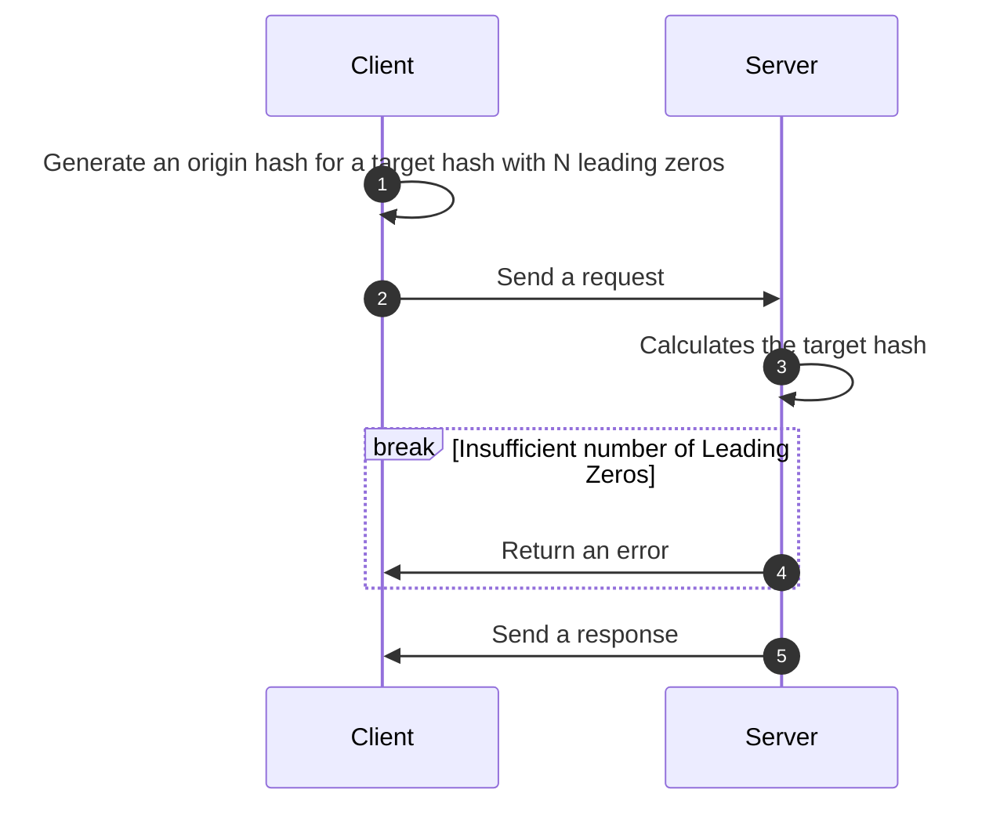

# POW Account

This library generates a cryptographic hash and performs a second round of hashing to produce a hash with a configurable number of leading zeros.
It is designed for applications requiring proof-of-work-like functionality or hash-based validation with adjustable difficulty.

## The algorithm of work
The sequence diagram below shows the high-level algorithm of client-server interaction.



*Step 1*. A Client generates an origin hash for a target hash that starts with a particular number of zeros. The required number of zeros is defined by the Server.

*Step 2*. A Client sends the request to the Server (for instance, to get an Auth Token).

*Step 3*. A Server calculates the target hash and checks if the target hash starts with the proper number of leading zeros.

*Step 4*. If the number is wrong returns an error.

*Step 5*. A Server returns a response.


## Installation
To install the library from your app folder run:
```
cargo add pow_account
```

Add required dependencies
```
cargo add blake2
cargo add hex
```

Or clone the repository to your app folder and add the following to your `Cargo.toml`:

```toml
[dependencies]
pow_account = { path = "../path/to/pow_account" }
blake2 = "0.10.6"
hex = "0.4.3"
```

## Usage
Here's a brief overview of how to use the library:

### Importing the Library

```rust
use pow_account::HashFinder;
```

### Generating an Origin Hash for a Target Hash with a default number of Leading Zeros
If you want to generate an origin hash for a target hash with the default number of leading zeros (which is 20 bits or 5 leading zeros), you can do so like this:
```rust
use pow_account::HashFinder;

let origin_hash = HashFinder::default().find();
let origin_hash_hex = hex::encode(origin_hash);
println!("Generated origin hash: {}", origin_hash_hex);
```

### Generating an Origin Hash for a Target Hash with a specified number of Leading Zeros
You can create a new `HashFinder` instance with a specified number of leading zeros and generate an origin hash as follows:
```rust
use pow_account::HashFinder;

let origin_hash = HashFinder::new(4).find();
let origin_hash_hex = hex::encode(origin_hash);
println!("Generated origin hash: {}", origin_hash_hex);
```
This will generate an origin hash for a Target Hash that starts with 4 leading zeros.

### Checking that the Target Hash starts with a required number of Leading Zeros
You can check the number of leading zeros for a hash as following:
```rust
use pow_account::HashFinder;

let origin_hash = HashFinder::default().find();
let origin_hash_hex = hex::encode(origin_hash);

// Default number of leading zeros
if let Ok(match_result) = HashFinder::default().check(origin_hash_hex) {
    ...
}

let origin_hash = HashFinder::new(4).find();
let origin_hash_hex = hex::encode(origin_hash);

// Custom number of leading zeros
if let Ok(match_result) = HashFinder::new(4).check(origin_hash_hex) {
    ...
}

```
This will generate an origin hash for a target hash that starts with 4 leading zeros.

## Example
Here’s a complete example demonstrating how to generate an origin hash and validate it:
```rust
use blake2::{Blake2s256, Digest};
use pow_account::HashFinder;

fn main() {
    // 1. Generating the origin hash (client side)
    let origin_hash = HashFinder::new(4).find();

    // This origin_hash_hex String is the one to be sent to the Server
    let origin_hash_hex = hex::encode(origin_hash); 

    // 2. Calculating the target hash (server side)
    let mut hasher = Blake2s256::new();
    hasher.update(&origin_hash);
    let target_hash: [u8; 32] = hasher.finalize().into();

    // This is the target hash that should be started with a specified number of leading zeros
    let target_hash_hex = hex::encode(target_hash);

    assert!(target_hash_hex.starts_with("0000"));
    println!("Generated hash with 4 leading zeros: {}", target_hash_hex);

    // Check that the target hash starts with 4 zeros
    if let Ok(match_result) = HashFinder::new(4).check(origin_hash_hex) {
        // Correct target hash
        println!("Result of match: {}", match_result);
    } else {
        // Error handler
    }
}
```

## Running Tests
To run the tests included with this library, use the following command in the root directory of your library:
```rust
cargo test
```

## Contributing
Contributions are welcome! Please feel free to submit a pull request or open an issue for any suggestions or improvements.

## License
This library is licensed under the MIT License. See the LICENSE file for more details.
